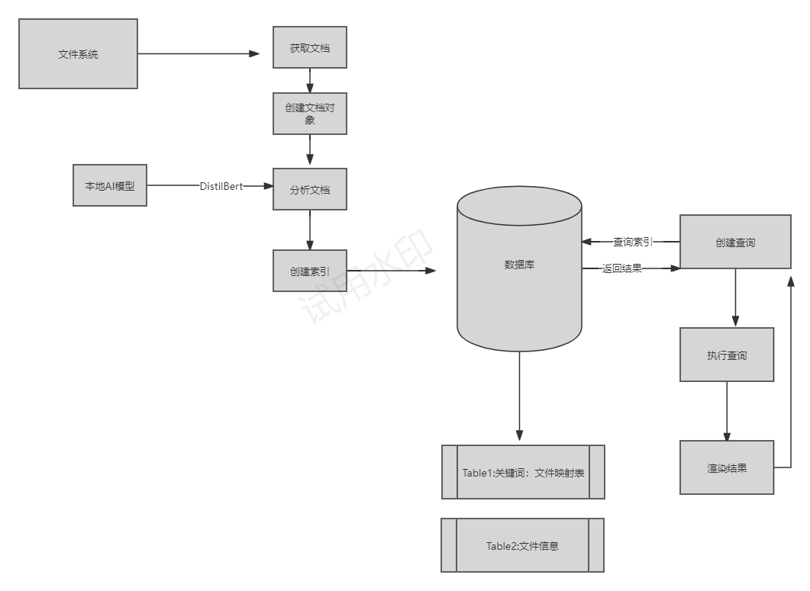

# 项目概述

## 项目简介

在 RVBook（基于 openEuler 操作系统的 RISC-V 架构笔记本电脑）上开发一款具有 AI 驱动的文件管理工具，支持通过本地 AI 模型实现高效的文件分类与全局搜索功能。支持用户通过关键词、文件类型、日期等多维度进行文件检索。研发时间关系，本期可只支持文本文件，暂不需要支持二进制格式文件、图片等。

## 开发思路

主体部分使用Qt编写，Qt文件与数据库files.db交互。

数据库files.db中有两个表keyword和file，分别记录关键字和文件的映射关系以及文件的信息。

数据库files.db由Qt调用Python程序生成。

## 组内分工

尹继营：负责Qt部分主要代码的编写工作，负责设计数据库

童瑜嫣：负责使用大模型进行关键词提取及相关数据库构建

贾辉：负责Qt部分与数据库相关部分的代码编写工作，负责Python部分文件遍历相关和预览相关

## github地址：

https://github.com/EwinLit/ManyThing

## 项目逻辑图



# 安装指南

## 运行环境

**CPU**：RISC-V

**操作系统**：openEuler

## 安装步骤

1. 按照**依赖管理**安装项目依赖
2. 按照README.md文件安装运行

## 依赖管理

1. 文档内容提取
   
   ```bash
   pip install PyPDF2
   pip install python-docx
   ```

2. NLP关键词提取
   
   ```bash
   pip install setuptools wheel
   pip install transformers
   pip install nltk
   ```

3. maturin及其依赖的rust工具链
   
   ```bash
   curl --proto '=https' --tlsv1.2 -sSf https://sh.rustup.rs | sh
   source $HOME/.cargo/env
   pip install maturin
   ```

4. 从源码安装pytorch
   
   ```bash
   wget https://github.com/pytorch/pytorch/releases/download/v2.4.0/pytorch-v2.4.0.tar.gz
   tar -xvf pytorch-2.4.0.tar.gz
   cd pytorch-v2.4.0/
   ```
   
   更新cpuinfo:
   
   ```bash
   cd third_party/
   rm cpuinfo/ -rf
   git clone https://github.com/sophgo/cpuinfo.git
   cd ..
   ```
   
   修改以下内容：

5. aten/src/ATen/CMakeLists.txt
   
   将`if(NOT MSVC AND NOT EMSCRIPTEN AND NOT INTERN_BUILD_MOBILE)`
   
   改为`if(FALSE)`

6. caffe2/CMakeLists.txt
   
   将`target_link_libraries(${test_name}_${CPU_CAPABILITY} c10 sleef gtest_main)`
   
   改为`target_link_libraries(${test_name}_${CPU_CAPABILITY} c10 gtest_main)`

7. test/cpp/api/CMakeLists.txt
   
   在语句下`add_executable(test_api ${TORCH_API_TEST_SOURCES})`
   
   添加`target_compile_options(test_api PUBLIC -Wno-nonnull)`

撰写构建脚本：

```bash
#!/bin/bash
export USE_CUDA=0
export USE_DISTRIBUTED=1
export USE_MKLDNN=0
export MAX_JOBS=5
python setup.py develop --cmake
```

将其保存为build.sh于pytorch-v2.4.0/的目录下，然后执行此脚本：

```bash
bash build.sh
```

# 功能介绍

可通过关键词检索数据库，获取与关键词相关的文件列表，若关键词为空，则返回包含所有文件的列表。

可通过文件名、文件路径、文件大小、文件类型、文件最后修改时间对文件进行排序和反向排序。

可通过文件名、文件类型、文件最后修改时间对文件进行过滤。

在软件中可对文本文件进行预览。

对于系统内文件总量超过 5000 个时，搜索结果的响应时间不超过 3 秒。

# 代码结构

## Qt部分：

**【C++部分约800行，xml部分共约260行】**

**【类之间无继承关系】**

**类之间依赖关系如下**

```
MyTime <-- MyFile <-- MySqlite <-- MainWindow

            ^                           |

            |                           |

            -----------------------------
```

### MyTime：

字段：

```c++
private:
    int year,month,day;
    int hour,minute,second;
```

方法：

```c++
public:
    MyTime();//默认构造函数
    MyTime(QDateTime _time);//通过QDateTime对象构造对象
    MyTime(QString);//通过字符串构造对象
    MyTime(int,int,int,int,int,int);//通过6个整数构造对象
    MyTime& operator=(const MyTime& obl);//重载，以实现变量间赋值
    bool operator>(const MyTime& obj);//重载，以实现排序
    bool operator<=(const MyTime& obj);//重载，以实现排序
    int getyear();//get方法
    int getmonth();//get方法
    int getday();//get方法
    int getHour();//get方法
    int getMinute();//get方法
    int getSecond();//get方法
    QString toString();//转化成字符串，便于打印
```

### MyFile：

字段：

```c++
private:
    QString name;
    QString path;
    double size;
    MyTime editTime;
    QString type;
```

方法：

```c++
public:
    MyFile(QString,QString,double,MyTime,QString);//根据每个字段的值初始化对象
    QString getName();//get方法
    QString getPath();//get方法
    QString getSize();//get方法
    double getDoubleSize();//get方法，返回双精度实型，以便排序
    QDateTime getMyEditTime();//get方法，返回QdateTime类型，以便排序
    QString getEditTime();//get方法
    QString getType();//get方法
    QDate getDate();//get方法
    QString toString();//转化成字符串，便于打印
```

### MySqlite：

字段：

```c++
private:
    QSqlDatabase db；
```

方法：

```c++
private:
    QList<MyFile> queryFile(QString,QString);//查询数据库表file
public:   
    MySqlite();//默认构造函数
    bool connectDataBase(QString);//连接数据库
    QList<MyFile> queryKeyWord(QString);//查询数据库表keyword
    void deleteTable();//清空数据库中的file表
    void insertItem(QString name,QString path,double size,QString time,QString type);//向数据库中的file表中插入数据
```

### MainWindow：

字段：

```c++
private:
    Ui::MainWindow *ui;
    QList<MyFile> myFileList;
    MySqlite dataBase;
    int sortStatus;
    QString pythonPath;
    QString workPath;
    QString bfsPath;
    QString splitSymbol;
    QQueue<QString> directory;
public:
    bool success;
```

方法：

```c++
public:
    MainWindow(QWidget *parent = nullptr);//构造函数
    ~MainWindow();//析构函数

private:
    //mainwindow.cpp
    void refreshTable(bool reverse);//刷新tableWidget
    void echoInfo(QString info);//设置statusBar
    void setIcon(int choice);//设置actionbutton的图标
    void setTestBrowser(int row);//设置testBrowser的文字

    //support.cpp
    void localize();//根据环境设置工作目录
    void sortName();//根据name排序
    void sortSize();//根据size排序
    void sortPath();//根据path排序
    void sortEditTime();//根据editTime排序
    void sortType();//根据type排序
    void filtrate(QString,QString,QDate);//根据时间/名字/扩展名筛选
    void search(QString);//根据关键词搜索数据库
    void handleCell(int,int);//处理双击tableWidget单元格事件
    void about();//显示作者信息
    void reverse(bool);//反转tableWidget
    void refreshDataBase();//刷新数据库file表
    void refreshKeyWord();//刷新数据库keyword表
    void horizontalSort(int);//点击表头排序
    void executePython(QString);//运行Python程序
    void bfsDirectory(QString);//遍历所有文件，以便用于生成数据库中file表
```

## Python部分：

### 根据关键词构建数据库

**【代码量约170行】**

extract_keywords.py

方法：

```python
    def read_text(file_path) # 读取不同类型的文本文件
    def extract_keywords(text, top_k=10) # 使用distilbart提取关键词，默认设置提取
    def save_keywords(keywords, output_file) # 保存提取出的关键词，以备后续构建数据库与查询
    def main(input_file, output_file) # 处理一个文件的文本读取与关键词提取保存
```

create_database.py

方法：

```python
def create_database(db_path) # 创建sqlite数据库和表
def add_data_to_database(db_path, documents) # 将文件与其关键词加入到数据库中
def search_keywords(db_path, query_str) # 根据检索关键字进行检索
def build_documents_dictionary(input_dir) # 从文件夹构建文档-关键词字典
def extract_keywords_from_nl(nl_query) # 从用户的自然语言检索需求中提取关键词
```

### 遍历文件相关

file_manage.py

```
def traverse_directory(directory_path) #遍历目录并返回所有符合条件的文件路径
```


### 预览相关

file_index_api.py

```
def get_all_files(self)#获取数据库所有文件的信息,并转化为字符列表
def get_files_by_extension(self, extension)#根据扩展名获取文件信息
```


# 数据库：

**数据库使用Sqlite。**

## Table1：files

**主键为：[path,name]**

| 字段   | 类型   |
|:----:|:----:|
| name | TEXT |
| path | TEXT |
| size | REAL |
| type | TEXT |
| time | TEXT |

## Table2：keyword

**主键为id，外键为[path,name]**

| 字段   | 类型      |
|:----:|:-------:|
| word | TEXT    |
| path | TEXT    |
| time | TEXT    |
| id   | INTEGER |
